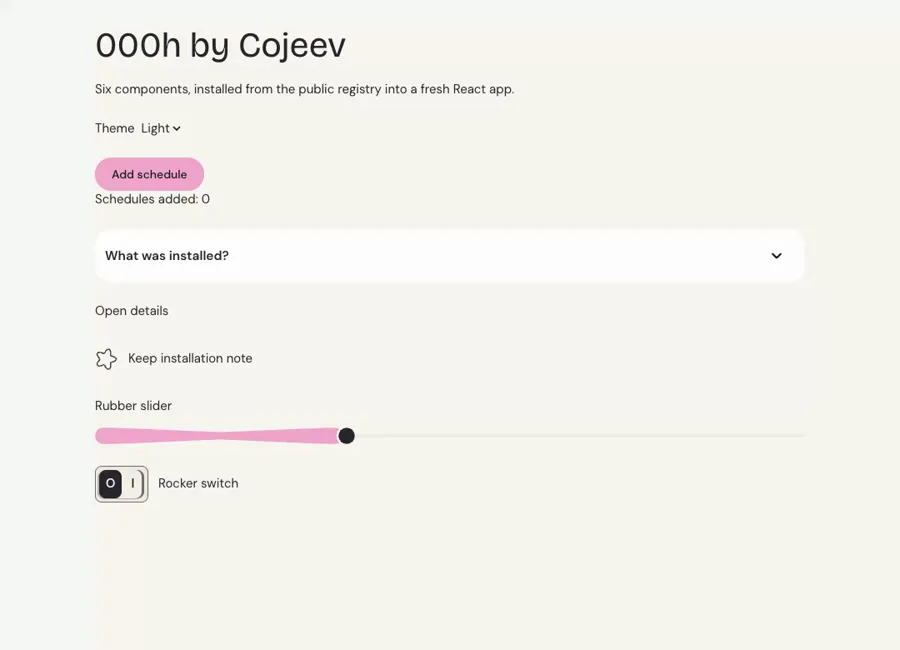

# PR #11899: fresh installation and review evidence

Checkpoint: K05-1, supporting K05 (submission and review). Captured 16 September 2026.

[Upstream submission](https://github.com/shadcn-ui/ui/pull/11899) remains **submitted, not accepted**. The proposed namespace is `@000h-cojeev`. This evidence supports review; it is not a full-library release or accessibility certification.

## Short demo



The recording shows a disposable React/Vite consumer using six components downloaded from `https://000h.cojeev.com`. Only demo text and labels were adjusted after installation; installed component source was not edited. The final demo scaffold was type-checked and built again.

[Light screenshot](evidence/pr-11899/light.png) · [Dark screenshot](evidence/pr-11899/dark.png)

## Results

| Check | Result | Execution time |
| --- | --- | --- |
| Official `pnpm validate:registries` on PR head `ca9d8df04d02fd1b9e062514b59e75202ed22fde` | Passed: directory schema, public payload, all entries included | 3.327 s |
| Fresh install with `shadcn@4.21.0`, TypeScript check, and Vite production build | Passed for button, accordion, dialog, checkbox, slider, switch and their dependencies | 58.385 s including setup and downloads |
| Final demo scaffold TypeScript check and production build | Passed | 3.906 s |
| Browser interaction demonstration | Passed the assertions below; recording inspected in light/dark | 28.4 s recording, including presentation pauses |

Toolchain actually resolved: Node 22.22.0, shadcn 4.21.0, React 19.3.0, Vite 7.3.6, TypeScript 5.9.3, Tailwind CSS 4.3.3.

An initial attempt failed after 51.095 s during upstream CLI initialization because a local npm cache object was missing (`ENOENT`), before downloading the Cojeev components. A new consumer with an isolated npm cache passed. This failed attempt is recorded separately rather than presented as a library defect or a passing test. Debugging, source inspection, visual review, and media/report packaging are excluded from the execution times above. No new test suite was written.

Vite emitted a non-failing bundle-size warning (JavaScript approximately 952 kB minified, 268 kB gzip). No bundle-size optimization or performance claim is made. The final recording session reported no browser console errors or warnings.

## Reproduce the fresh installation

The unchanged [consumer verification script](https://github.com/luv-jeri/cojeev-ui/blob/7908a61b2bdb519d9069066ba5028696b9cc9a5a/scripts/verify-install.mjs) has SHA-256 `d39150f91033c704f073116e1680bc9a7bead198ee09c6762558a58e34f9d3b5`.

```sh
npm_config_cache=/tmp/cojeev-review-cache node scripts/verify-install.mjs \
  --url=https://000h.cojeev.com \
  --components=button,accordion,dialog,checkbox,slider,switch \
  --tmp=/tmp/cojeev-review-consumers \
  --receipt=/tmp/cojeev-review-install.json
```

The script creates a new empty consumer, installs dependencies, runs pinned `shadcn@4.21.0 init`, then downloads these six public component URLs through `shadcn add`. It runs `tsc --noEmit && vite build`. The namespace is still pending acceptance, so this evidence uses public URLs rather than claiming default namespace discovery works.

Installation receipt (temporary path redacted; browser checks were performed afterward):

```json
{
  "directory": "<fresh temporary consumer>",
  "baseURL": "https://000h.cojeev.com",
  "components": [
    "button",
    "accordion",
    "dialog",
    "checkbox",
    "slider",
    "switch"
  ],
  "foundationOnly": false,
  "installer": "shadcn@4.21.0",
  "node": "v22.22.0",
  "startedAt": "2026-09-16T07:00:17.114Z",
  "build": "PASS",
  "freshDirectory": true,
  "screenshotVerification": "not-run",
  "checks": {
    "publicCLIInstall": "PASS",
    "typecheckAndBuild": "PASS"
  },
  "replacedGeneratedScaffold": true,
  "finishedAt": "2026-09-16T07:01:15.499Z",
  "runtimeSeconds": 58.385
}
```

## Official directory validation

The exact upstream PR head was checked out in an isolated clone. Only the validator runtime dependencies (`tsx@4.20.3`, `zod@3.25.76`, matching the upstream lockfile) were installed in an external tools folder and exposed through an ignored `node_modules` symlink. The upstream validator, schemas, directory JSON, and package scripts were unchanged. Running the documented root command produced exit code 0:

```text
> ui@0.0.1 validate:registries <upstream-checkout>
> pnpm --filter=v4 validate:registries


> v4@0.1.0 validate:registries <upstream-checkout>/apps/v4
> tsx --tsconfig ./tsconfig.scripts.json ./scripts/validate-registries.mts

✅ directory.json is valid
✅ /r/registries.json payload is valid
✅ /r/registries.json includes all directory entries

✅ All registries passed validation.
```

This command validates directory metadata and its public projection. It does not claim to install or health-check every community registry.

## Browser checks

- Button click changed the visible counter from 0 to 1.
- Flower checkbox became checked.
- Slider responded to keyboard End (value 100), Home, and ArrowRight.
- Rocker switch exposed `aria-checked=true` after a click.
- Accordion revealed its content.
- Dialog became visible and closed with Escape.
- Dark and light themes were captured and visually inspected.

Scope: these six components in one desktop Chromium consumer. The complete catalogue, other browsers, mobile layouts, exhaustive accessibility, and release gates were not run for this review-evidence task.

## Follow-up and remaining external gate

One [short follow-up](https://github.com/shadcn-ui/ui/pull/11899#issuecomment-5693390512) was posted by `luv-jeri`, tagging only `@shadcn`. Maintainer selection is supported by his merge of the latest [directory batch, PR #11861](https://github.com/shadcn-ui/ui/pull/11861), on 12 September.

At verification, signed-commit and Socket checks passed; the Vercel status said **Authorization required to deploy**. That preview authorization and the inclusion decision belong to the maintainers. No approval, merge, or directory acceptance is claimed.

[Official submission guide](https://ui.shadcn.com/docs/registry/registry-index)
