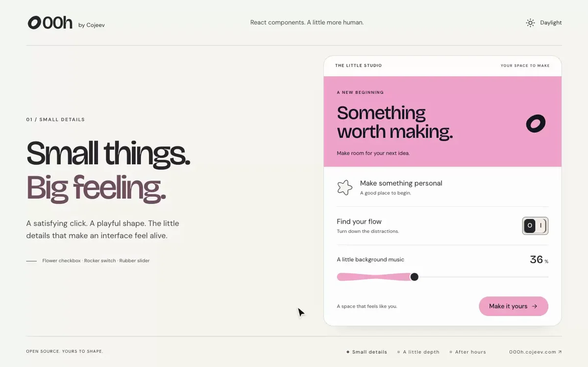

# PR #11899: replacement component showcase

Checkpoint: K05-2, following K05-1 / [PR #70](https://github.com/luv-jeri/cojeev-ui/pull/70). Recorded 16 September 2026.

Status: **ready for owner visual review**. The previous clip was rejected as a demo. This replacement has not yet replaced the clip in the upstream submission. The directory submission remains [open](https://github.com/shadcn-ui/ui/pull/11899); no maintainer acceptance is claimed.

## Preview



[Light](evidence/pr-11899/showcase-light.png) · [Drawer](evidence/pr-11899/showcase-drawer.png) · [Dark](evidence/pr-11899/showcase-dark.png) · [Demo source](evidence/pr-11899/showcase-source.md)

The recording shows a newly installed React/Vite consumer. The surrounding “Little Studio” composition provides readable context for the real components: flower checkbox, rocker switch, rubber slider, button/animated icon, and stacked motion drawer. The sequence ends with the same control state in dark mode and a short website closing frame. Accordion and dialog were also freshly installed and built but are not shown in this replacement clip.

Installed component source and registry styles were not edited. The composition uses the public fonts and colour tokens. A visible cursor follows actual browser pointer events; clicks, dragging, tab selection, and theme changes are real. The music and save controls demonstrate local state only; the sample does not play music or persist settings. The clip is silent, recorded at 1440 × 900 and 25 fps, with a 1200 × 750, 20 fps animated WebP for GitHub (27.65 seconds, 4,889,840 bytes).

## Verification

| Check | Result | Execution time |
| --- | --- | --- |
| Fresh public installation, TypeScript check and production build | Passed for eight requested components and their dependencies | 108.273 s, including setup/downloads |
| Final showcase TypeScript check and production build | Passed | 4.154 s |
| Focused browser interaction assertions | Passed | 2.649 s |
| Visual inspection | Light, drawer, palette, dark, closing frame, and recording contact sheet inspected; independent review found no material issues in the four principal stills | Review time, not test execution |
| Media validation | MP4/WebP decoded; dimensions and duration checked; recording sequence inspected | Packaging time, not test execution |

Successful install/build/browser execution totals **115.076 seconds**. This excludes composition work, troubleshooting, review, recording, and encoding. WebP encoding took 21.582 seconds. No test suite was added.

An initial showcase build failed after 15.061 seconds because the demo used `diamond` as a checkbox shape; the supported `leaf` shape corrected the demo. An initial browser script used an ambiguous status locator, then a fixed 500 ms delay checked the drawer before its exit animation had unmounted it. The final check targets the save-status element and waits for the actual drawer removal with a bounded timeout. No library change was required. These attempts are not reported as passes.

The final build retains a non-failing bundle-size warning (987.85 kB minified JavaScript, 279.40 kB gzip). No performance claim is made. The final browser run recorded no console errors or warnings; the development build prints the usual React DevTools informational message.

Browser assertions cover checkbox/switch state, slider keyboard input, button feedback, drawer tab selection, Escape dismissal, focus return, dark mode, and state preservation across chapters. The recording additionally exercises actual slider dragging and all three drawer panels. Desktop document height was exactly 900 px in a 1440 × 900 viewport, with no page clipping. Coverage is limited to this desktop Chromium consumer; mobile, other browsers, the whole catalogue, and release gates were not run.

## Reproduce the installation

Using the unchanged repository consumer-verification script:

```sh
npm_config_cache=/tmp/cojeev-showcase-cache node scripts/verify-install.mjs \
  --url=https://000h.cojeev.com \
  --components=button,accordion,dialog,checkbox,slider,switch,animated-icon,motion-drawer \
  --tmp=/tmp/cojeev-showcase-consumers \
  --receipt=/tmp/cojeev-showcase-install.json
```

The resolved installer was `shadcn@4.21.0` on Node 22.22.0. The script created an empty consumer at 08:21:22.580 UTC and finished at 08:23:10.853 UTC on 16 September. The namespace remains pending, so installation uses the public component URLs. Then apply the [showcase source](evidence/pr-11899/showcase-source.md) and run `npm run build`.

## Directory validation and publication

The [earlier validation record](2026-09-16-pr-11899-review-evidence.md#official-directory-validation) remains applicable to upstream head `ca9d8df04d02fd1b9e062514b59e75202ed22fde`, reconfirmed unchanged for this checkpoint. The official validator passed in 3.327 seconds in K05-1; it was not rerun for this media-only replacement.

Owner visual approval remains pending under the [checkpoint workflow](../checkpoint-workflow.md). After approval, replace the existing upstream demo link/image and edit the existing follow-up to point to this evidence. Do not post a second reminder or tag additional people. Reverting this documentation/media checkpoint restores the earlier presentation; no application release or production deployment is involved.
