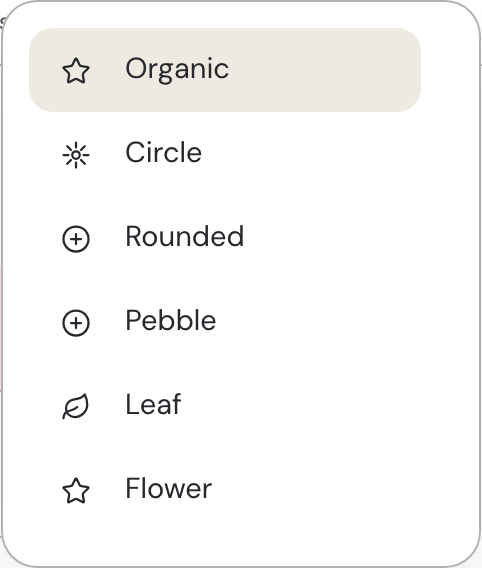
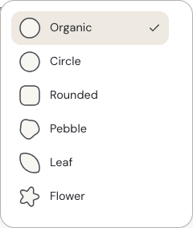
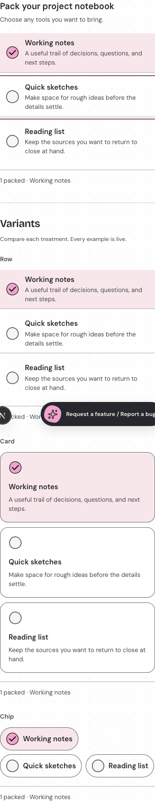

# H03-2 — choice workbench evidence

13 September 2026. Approved design: [H03-1](../../../superpowers/specs/2026-09-13-preservation-first-polish-design.md).
Implementation `569ab7f` has the identical tree to tested `ada276d`; rebased onto merged design PR #24 without source changes.

## Result

The shape menu displays the actual six retained silhouettes and a selected checkmark. Compact comparisons omit repeated introductions but keep named groups and live selection feedback. Row has one closing divider. Shapes, marks, selected values and Row/Card/Chip remain available; no shared morph or Select behavior changed.

| Before | After |
| --- | --- |
|  |  |

Captures have different pixel densities; compare content, not apparent scale.

## Focused verification

- `DOCS_BASE_URL=http://127.0.0.1:4322 node tests/choice-recovery.docs.browser.mjs`: passed both components, all approaches, shapes, keyboard/state retention, menu hit targets, copy settings and 24 responsive captures.
- `node --import tsx --test tests/registry-imports.test.ts tests/choice-appearance.test.ts tests/item-adornment.test.ts tests/docs-preview.test.ts`: 10 passed. Compact-header and silhouette assertions failed before the fix and passed afterward.
- `node --test tests/registry-notices.test.mjs`: 5 passed; `node scripts/check-foundation-downloads.mjs`: 14 downloads / 112 source files matched.
- Type checking and lint on changed source: passed. Registry generation changed only the shared choice stylesheet in Checkbox, Radio and Switch payloads.
- `POLISH_URL=http://127.0.0.1:4322 node tests/docs-compact-navigation.browser.mjs`: light and dark passed.
- Primary personally inspected the source, live menu and desktop/mobile captures in both themes, including Row/Card/Chip and compact galleries. Quiet/reduced-motion checks were additionally recorded by the implementer.

## Acceptance boundaries

Rendered owner approval and applicable CI are still pending. The full catalogue, release gate, deployment and registry submission were not run. The existing fixed feedback launcher can overlap the lower-right of mobile captures; it was not hidden. Organic and Circle intentionally retain their similar existing small-scale outlines. Flow Off was not separately enumerated.

Independent review: spec and quality passed with no blocking findings; the pair is compatible with V50-1. The mobile launcher obscures one compact Row status line, so that line is supported by the browser assertion, not this screenshot. No screenshot-only hiding was added. Primary also reran the 10 focused unit tests on the rebased source; all passed.
