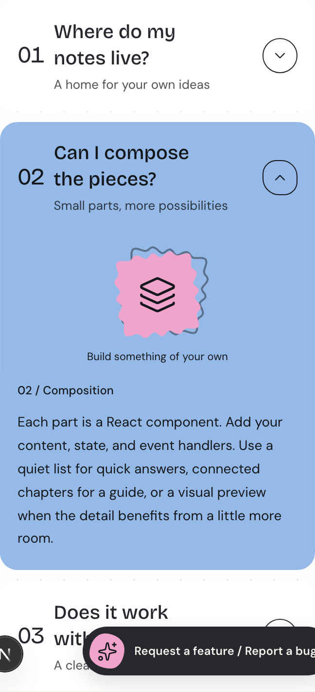
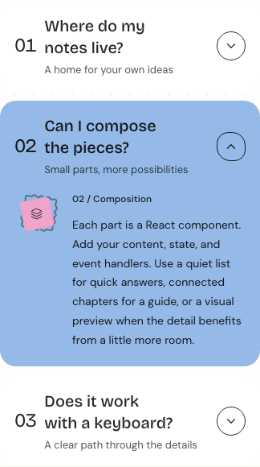
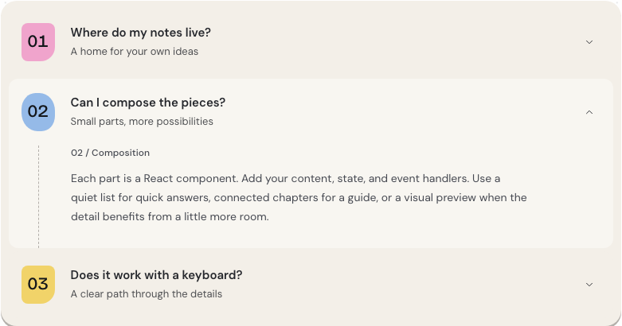

# V50-1 — Accordion evidence

13 September 2026. Approved design: [H03-1](../../../superpowers/specs/2026-09-13-preservation-first-polish-design.md).
Implementation `5128ce3` has the identical tree to tested `e552f19`; rebased onto merged design PR #24 without source changes.

## Result

FAQ has a quiet resting surface. Chapters aligns answer and title exactly. Editorial art is subordinate at 96px desktop and 56px mobile, beside the answer rather than above it. All three approaches, native semantics and the existing motion controller remain unchanged. Keyboard focus now falls back to the defined ring token.

| Before: Editorial on mobile | After: Editorial on mobile |
| --- | --- |
|  |  |

Captures have different pixel densities; compare composition, not apparent scale.

## Focused verification

- `DOCS_BASE_URL=http://127.0.0.1:4323 node tests/disclosure-recovery.docs.browser.mjs`: passed all approaches, keyboard/focus, rapid reversal, stable hit targets, real height motion and responsive checks.
- Before/after assertions: Chapters offset was -2px desktop / +2px mobile, now 0px; mobile art was 288px above the answer, now 56px beside it. Desktop art is 96px beside a roughly 600px answer column.
- `tests/disclosure-slots.test.tsx`: 2 passed; `tests/reference-galleries.test.ts`: 9 passed; `tests/registry-imports.test.ts`: 2 passed; `tests/registry-notices.test.mjs`: 5 passed.
- Type checking and changed-test lint passed. Generated Accordion payload differs only in its embedded stylesheet.
- Long titles wrap without overflow. Quiet-motion content is visible/non-inert. Primary personally reviewed code, desktop/mobile light/dark captures and real keyboard focus; the implementer additionally reviewed all 12 captures.

## Acceptance boundaries

Rendered owner approval and applicable CI remain pending. No full catalogue, release gate, deployment or registry submission was run. No disclosure controller or public API changed.

Independent review: spec and quality passed with no blocking findings. The separate quiet screenshot predates the final focus-token edit and is excluded from current visual evidence; reduced-motion checks ran against the final source. FAQ hover now increases accent from 7% to 12%, a smaller contrast step than before. The subtle tint varies perceptually by hue. Desktop captions were visually inspected but do not have a dedicated overflow assertion. These are disclosed limits, not claims of complete visual certification.

Follow-up outside this checkpoint: Bento builder also references the undefined `--v-focus` token at `registry/cojeev/styles/bento-builder.css` lines 106 and 147. Investigate its keyboard focus separately; this PR does not claim that issue fixed.
